## **Setting Up Git on Windows**

#### **Objective:**
Install Git on your Windows machine and configure it with your username and email.

---

### **Step 1: Download Git for Windows**
1. Open your web browser and navigate to the official Git website: [https://git-scm.com/](https://git-scm.com/).
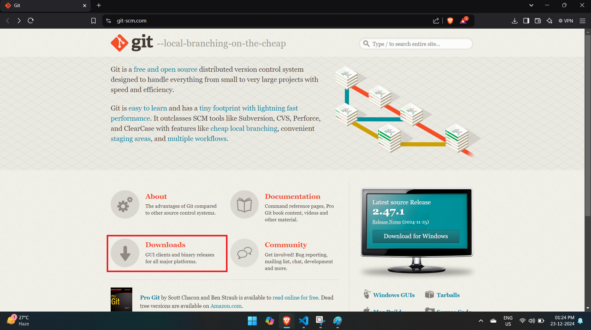

2. On the homepage, you’ll see a "Download" button that should automatically detect your operating system. Click on it to download the Git installer for Windows.
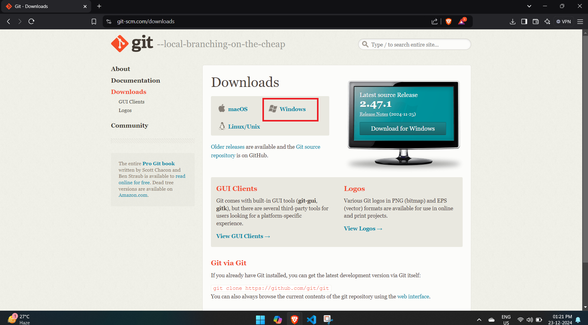

3. The Git installer will start downloading automatically. Once the download is complete, locate the `.exe` file in your Downloads folder.
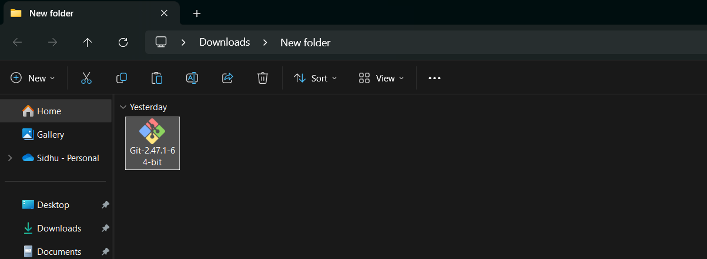
---

### **Step 2: Install Git**
1. Double-click the downloaded `.exe` file to start the Git installation process. It ask for permitions click on Yes.
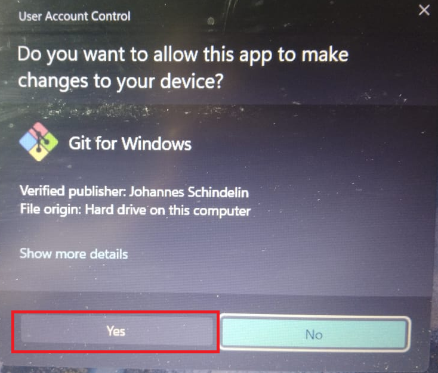

2. **Select the installation options**:
   - You will get this screen click on Next
   

   - **Choose the installation location**: The default is usually fine (e.g., `C:\Program Files\Git`). Click on Next.
   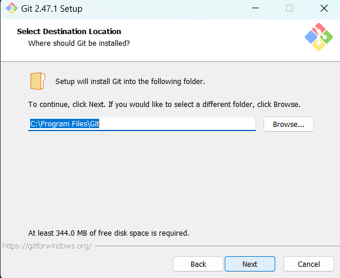
   - **Select components**: Keep the default options selected, which include extra icons and the Git Bash tool.
   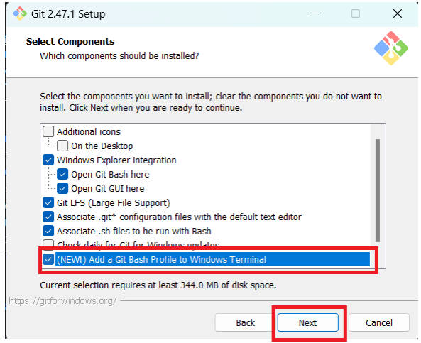
   - **Adjust your PATH environment**: Choose the option to add Git to your PATH so it can be accessed from the command line.
   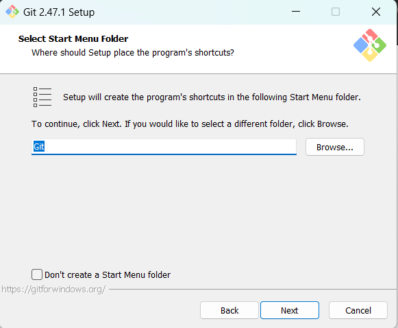

   - **Choose HTTPS transport backend**: The default setting (use the OpenSSL library) is recommended.
    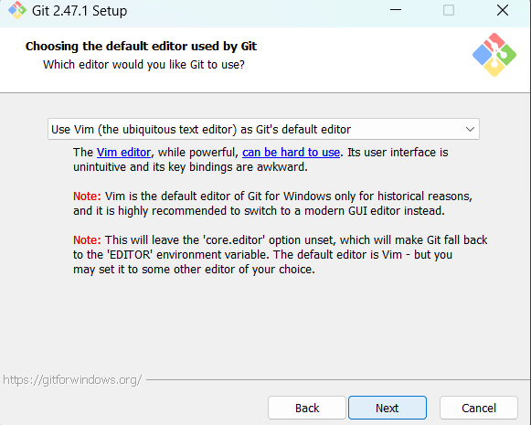

   - **Configuring the line ending conversions**: Select `Checkout Windows-style, commit Unix-style line endings` (recommended for most cases).
    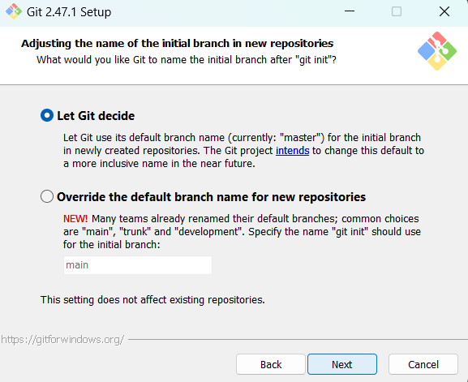

   - **Choose the terminal emulator to use with Git Bash**: The default "Use MinTTY" option is recommended, as it provides a better terminal experience.
   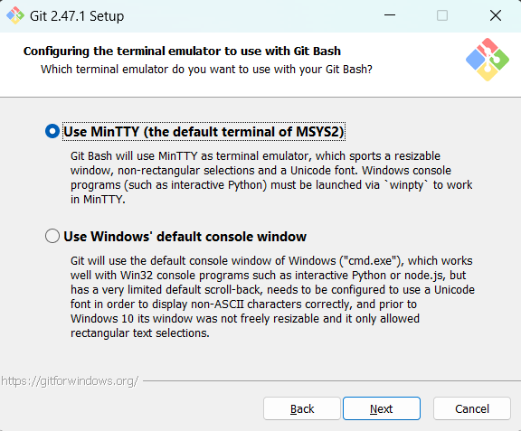
   
3. Click **Next** and proceed through the remaining prompts. Finally, click **Install** to begin the installation.

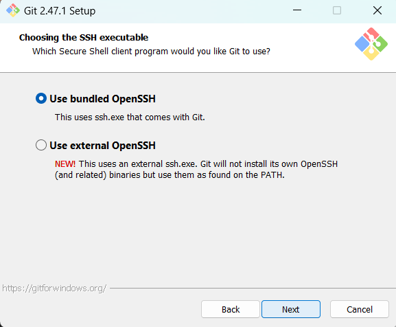
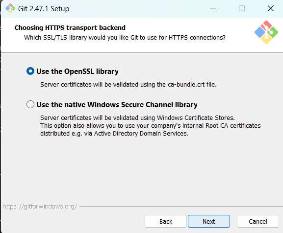
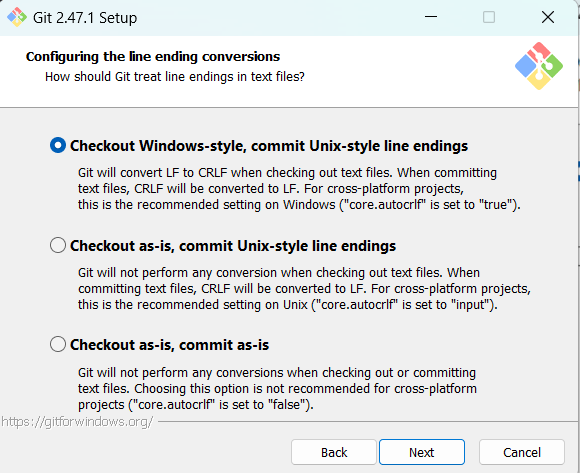

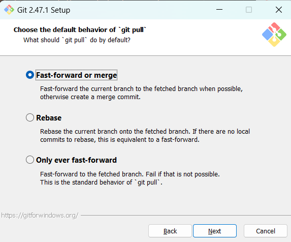
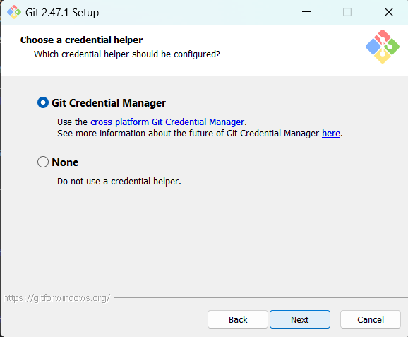
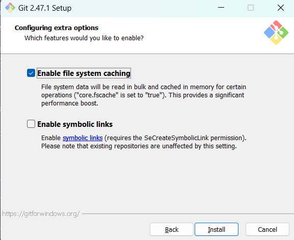
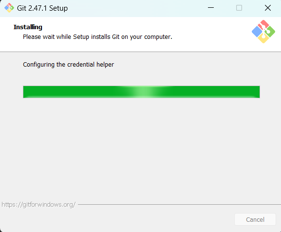


4. Once the installation is complete, click **Finish**.
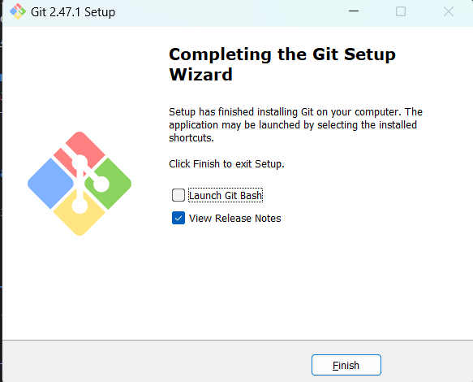

---

### **Step 3: Verify the Installation**
1. After installation, open **Git Bash** (you can search for it in the Start Menu).
2. To verify that Git is correctly installed, type the following command in the Git Bash window:
   ```bash
   git --version
   ```
   This should return the installed version of Git, for example:
   ```
   git version 2.47.1.windows.1
   ```
    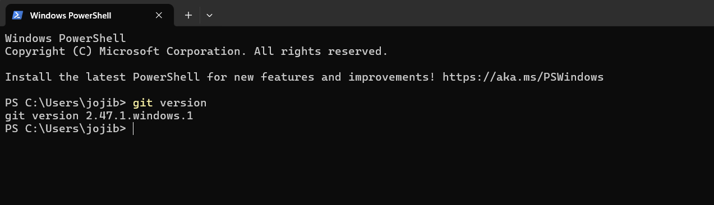
---

### **Step 4: Configure Git with Your Username and Email**
1. Now that Git is installed, you need to configure it with your name and email, which will be used in commit history.

2. Open **Git Bash** and enter the following commands to set your username and email:
   
   - Set your username:
     ```bash
     git config --global user.name "Your Name"
     ```

   - Set your email:
     ```bash
     git config --global user.email "your_email@example.com"
     ```

   These details will be associated with all of your Git commits.
    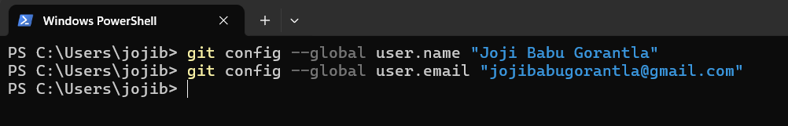
---

### **Step 5: Verify Configuration**
1. To confirm that your username and email have been set correctly, you can use the following commands:
   
   - Check your username:
     ```bash
     git config --global user.name
     ```

   - Check your email:
     ```bash
     git config --global user.email
     ```

   These commands should return the information you just configured.
   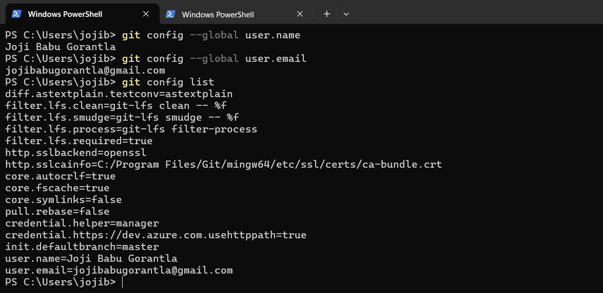
---

### **Step 6: Create a New Git Repository (Optional)**
1. To create a new repository, navigate to a folder where you want to create the project. For example:
   ```bash
   mkdir my-project
   cd my-project
   ```
   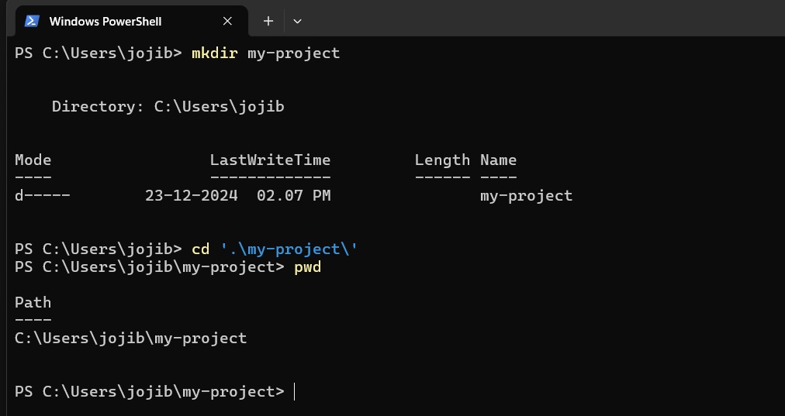

2. Initialize a Git repository in the folder:
   ```bash
   git init
   ```
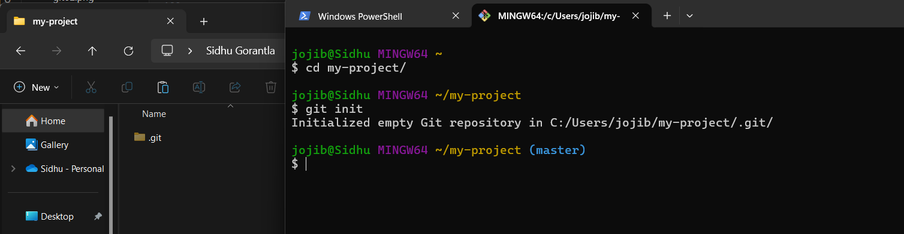
3. Your folder is now a Git repository. You can start adding files and making commits.

---
Sure! Below is a brief guide and summary of your experience practicing basic Git commands like `git init`, `git add`, and `git commit`.

---

## **Basic Git Commands Practice**

### **Step 1: Create a Local Git Repository**

1. **Navigate to your project directory:**
   Open your terminal (Git Bash or Command Prompt) and navigate to the folder where you want to create your Git repository.
   For example:
   ```bash
   cd C:/Users/YourName/Documents/GitPractice
   ```
   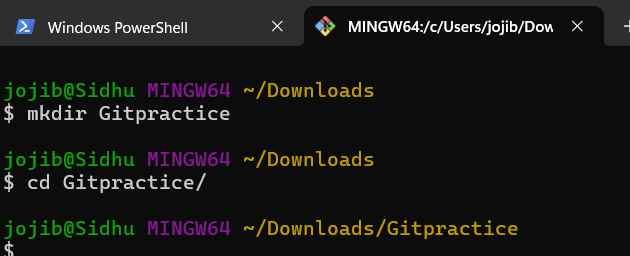

2. **Initialize the Git repository:**
   Run the following command to initialize a new Git repository:
   ```bash
   git init
   ```
   This command creates a new `.git` directory in the folder, indicating that the folder is now a Git repository.

   **Expected Output:**
   ```
   Initialized empty Git repository in C:/Users/YourName/Documents/GitPractice/.git/
   ```
   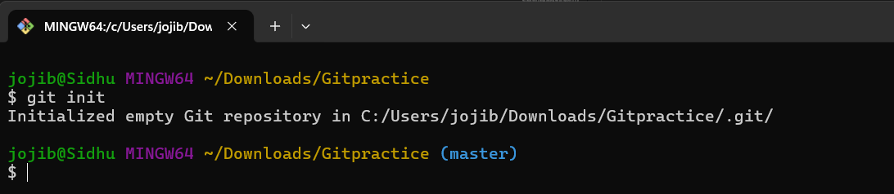

3. **Verify that the repository was initialized:**
   You can check if the Git repository was initialized successfully by running:
   ```bash
   git status
   ```
   This should return a message indicating that your repository is in an uncommitted state.
   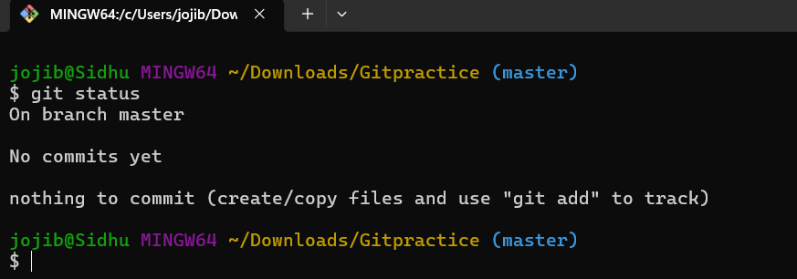

---

### **Step 2: Add Files to the Repository**

1. **Create a new file:**
   Open your text editor and create a simple text file. For example, create a file called `example.txt` and add some content like:
   ```bash
   cat > example.txt
   Hello, this is my first Git file!

   git status
   ```
   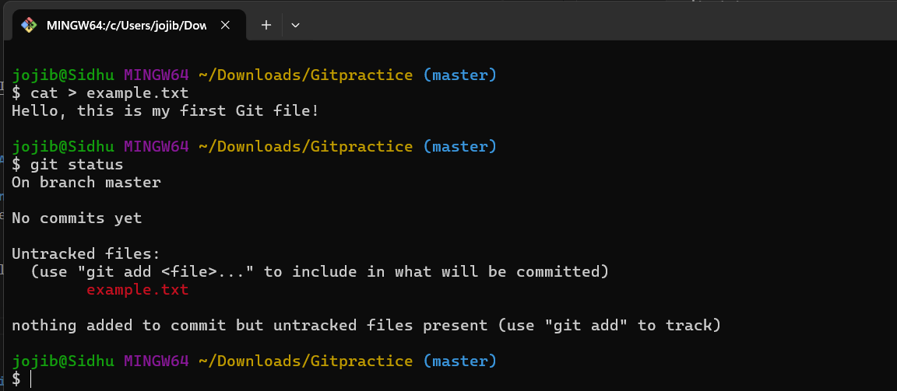

2. **Add the file to Git:**
   After saving the file, go back to your terminal and run the following command to stage the file for commit:
   ```bash
   git add example.txt
   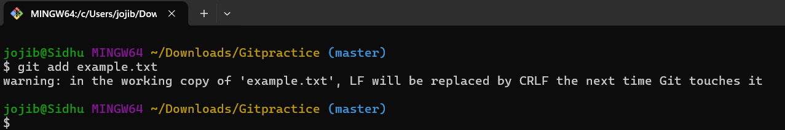
   ```
   This tells Git to start tracking the file.

3. **Verify the status:**
   Run `git status` again to check that `example.txt` has been added to the staging area:
   ```bash
   git status
   ```
   **Expected Output:**
   ```
   On branch master
   Changes to be committed:
     (use "git reset HEAD <file>..." to unstage)
         new file:   example.txt
   ```
    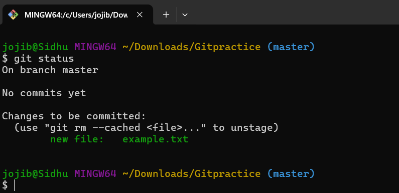
---

### **Step 3: Commit the Changes**

1. **Commit the changes:**
   Once the file is staged, you need to commit the changes. Run the following command:
   ```bash
   git commit -m "Add example.txt with initial content"
   ```

2. **Verify the commit:**
   After committing, Git will provide an output confirming the commit was successful:
   ```
   [master (root-commit) 1234567] Add example.txt with initial content
    1 file changed, 1 insertion(+)
    create mode 100644 example.txt
   ```

3. **Check commit history:**
   You can check the commit history with:
   ```bash
   git log
   ```
   This should show you the commit history, including your latest commit.
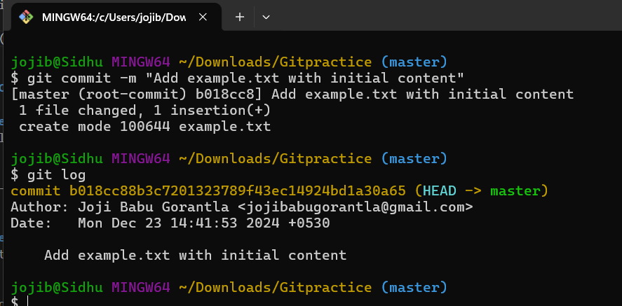
---

### **Summary of Experience**

1. **Using `git init`:**
   The `git init` command was easy to use and created a new Git repository in my folder. I was able to confirm this by checking for the `.git` folder.

2. **Using `git add`:**
   I used the `git add` command to stage my `example.txt` file. It was straightforward to add individual files, but I had to remember to specify the filename correctly. I accidentally tried to add a file with a typo in the filename at first, and I got an error message indicating that the file could not be found. To resolve this, I double-checked the filename and used `git status` to confirm the file was staged.

3. **Using `git commit`:**
   Committing changes was simple using `git commit -m`. I made sure to provide a meaningful commit message. Initially, I forgot to include the `-m` flag and got an error message telling me that I needed to provide a commit message. To fix this, I included the message directly in the command with `-m "Commit message"`. After committing successfully, I used `git log` to verify my commit.

4. **Common Errors Encountered:**
   - **Error 1: File not found** – I mistakenly typed the wrong filename when using `git add`. Git gave an error saying the file didn’t exist.
     - **Resolution**: I corrected the filename and re-ran the `git add` command.
   - **Error 2: Missing commit message** – I tried to commit without using the `-m` flag for the commit message, and Git prompted me to enter a message.
     - **Resolution**: I added `-m "Commit message"` to the commit command to fix the issue.

5. **What I Learned:**
   - The process of initializing a Git repository, staging files, and committing changes is fairly intuitive once you understand the basic workflow.
   - Running `git status` often is very helpful to track what files have been staged and which changes still need to be committed.
   - Remembering to write meaningful commit messages is important for tracking the history of changes in a project.

---
## **Create a README.md File**
---

```markdown
# To-Do List Application

## Description
The To-Do List Application is a simple Python-based app that allows users to manage their daily tasks. It provides functionality to add, view, update, and delete tasks, helping users stay organized and productive.

## Features
- Add new tasks with a description and due date.
- View all tasks with their current status (completed or pending).
- Edit existing tasks to update descriptions or due dates.
- Mark tasks as completed or delete tasks when done.

## Tech Stack
- Python 3.x
- SQLite (for storing tasks)
- Tkinter (for GUI)

## Setup Instructions

### Prerequisites
Before you begin, ensure you have the following installed on your machine:
- [Python 3.x](https://www.python.org/downloads/)
- SQLite (comes pre-installed with Python)

### Installation

1. **Clone the repository**:
   Open your terminal or command prompt and run the following command to clone this project:
   ```bash
   git clone https://github.com/yourusername/todo-list-app.git
   ```

2. **Navigate to the project folder**:
   ```bash
   cd todo-list-app
   ```

3. **Install dependencies**:
   The project uses Tkinter for the GUI, which typically comes with Python. However, if it is not installed, you can install it with:
   ```bash
   pip install tk
   ```

4. **Run the application**:
   After installation, you can run the application with:
   ```bash
   python todo_app.py
   ```

### Database Setup
The application uses SQLite to store tasks. On first launch, a database file (`tasks.db`) will be created automatically in the project directory.

---

## Usage

### Adding a Task
1. Launch the application.
2. In the main window, click on the "Add Task" button.
3. Fill out the task description and set a due date.
4. Click "Save" to add the task to your list.

### Viewing Tasks
The main window displays a list of all tasks, along with their current status (completed or pending). You can scroll through the list and select a task to edit or mark as completed.

### Marking a Task as Completed
1. Select a task from the list.
2. Click the "Mark as Completed" button to update the task’s status.

### Editing a Task
1. Select a task from the list.
2. Click the "Edit Task" button to modify the description or due date.
3. Save the changes to update the task.

### Deleting a Task
1. Select a task from the list.
2. Click the "Delete Task" button to remove the task permanently.

---

## Example

Here’s how the application looks in action:

1. Add a new task:

   ```
   Task: "Finish homework"
   Due Date: "2024-12-30"
   ```

2. View the task list:
   
   | Task                | Due Date    | Status       |
   |---------------------|-------------|--------------|
   | Finish homework      | 2024-12-30  | Pending      |

3. Mark the task as completed:
   
   | Task                | Due Date    | Status       |
   |---------------------|-------------|--------------|
   | Finish homework      | 2024-12-30  | Completed    |

---

## Contributing

We welcome contributions! If you'd like to contribute to the project, please follow these steps:

1. Fork the repository.
2. Create a new branch (`git checkout -b feature-name`).
3. Make your changes and commit them (`git commit -am 'Add feature'`).
4. Push to the branch (`git push origin feature-name`).
5. Create a pull request.

---

## License

This project is licensed under the MIT License - see the [LICENSE](LICENSE) file for details.

---

## Contact

For any questions or suggestions, feel free to contact me:

- Email: [your.email@example.com](mailto:your.email@example.com)
- GitHub: [https://github.com/yourusername](https://github.com/yourusername)
```

---

### **Explanation of Sections:**

1. **Project Title & Description**:
   - The project title (`To-Do List Application`) is the name of the application.
   - The description provides a short summary of what the project does.

2. **Tech Stack**:
   - A list of technologies used in the project (Python, SQLite, Tkinter).

3. **Setup Instructions**:
   - Step-by-step guide to install and run the project. This includes prerequisites, installation steps, and any necessary commands.

4. **Usage**:
   - Instructions on how to use the app after installation, including adding, editing, and deleting tasks.

5. **Example**:
   - A table showing an example of tasks that the user could add, with their status and due dates.

6. **Contributing**:
   - Guidelines on how others can contribute to the project by forking the repo, making changes, and submitting a pull request.

7. **License**:
   - A section about licensing, with a reference to the MIT License (this can be adjusted to match your project's actual license).

8. **Contact**:
   - Contact information for users or contributors who might have questions or suggestions.

---

### How to Submit via Google Docs:

To submit the `README.md` file via Google Docs:

1. Copy the content of the `README.md` file above.
2. Open Google Docs and create a new document.
3. Paste the content into the new document.
4. Share the document with anyone for review or submit the link to your instructor, depending on the submission method.

Let me know if you need further modifications or have any questions!

```
------

## **Git Status and Log**


### **Objective**:
Create a file in your Git repository, make changes, use the `git status` command to track changes, commit those changes, and then use the `git log` command to view the commit history.

### **Tools**:
- Git CLI (Command Line Interface)
- A text editor (e.g., Visual Studio Code, Notepad++)

---

### **Step 1: Create a File in Your Repository**

1. **Navigate to your Git repository**:
   Open Git Bash or your terminal and go to the folder where your Git repository is located. For example:
   ```bash
   cd path/to/your/repository
   ```

2. **Create a new file**:
   Use your text editor to create a new file. Let's create a file named `new_file.txt` and add some content like:
   ```txt
   This is my first file created in the Git repository.
   ```

3. **Check the repository status**:
   Before adding the new file to Git, use the `git status` command to check the status of the repository:
   ```bash
   git status
   ```

   **Expected Output**:
   The output should indicate that there is a new untracked file (`new_file.txt`) in your working directory:
   ```
   On branch master
   Untracked files:
     (use "git add <file>..." to include in what will be committed)
           new_file.txt
   ```

---

### **Step 2: Add the File to the Staging Area**

1. **Add the file to the staging area**:
   Use the `git add` command to stage the new file for commit:
   ```bash
   git add new_file.txt
   ```

2. **Check the repository status again**:
   Run `git status` again to verify that the file is staged:
   ```bash
   git status
   ```

   **Expected Output**:
   ```
   On branch master
   Changes to be committed:
     (use "git reset HEAD <file>..." to unstage)
           new file:   new_file.txt
   ```

   This output tells you that `new_file.txt` is staged and ready to be committed.

---

### **Step 3: Commit the Changes**

1. **Commit the changes**:
   Now that the file is staged, you can commit it to the repository with the following command:
   ```bash
   git commit -m "Add new_file.txt with initial content"
   ```

2. **Check the commit history**:
   After committing, you can view your commit history using the `git log` command:
   ```bash
   git log
   ```

   **Expected Output**:
   The `git log` command will display the commit history, showing information such as the commit hash, author, date, and commit message. You should see an output similar to:
   ```
   commit abc1234567890abcdef1234567890abcdef12345 (HEAD -> master)
   Author: Your Name <your_email@example.com>
   Date:   Sun Dec 23 12:34:56 2024 -0500

       Add new_file.txt with initial content
   ```

   This output confirms the details of your commit, including the commit hash, the author information, and the commit message.

---

### **Step 4: Make Changes to the File**

1. **Modify the file**:
   Open `new_file.txt` again in your text editor and add more content. For example, add the following:
   ```txt
   This is a second line of content added to the file.
   ```

2. **Check the repository status**:
   Use the `git status` command again to check the status of the repository after making the changes:
   ```bash
   git status
   ```

   **Expected Output**:
   The output should now indicate that the file has been modified:
   ```
   On branch master
   Changes not staged for commit:
     (use "git add <file>..." to update what will be committed)
     (use "git restore <file>..." to discard changes in working directory)
           modified:   new_file.txt
   ```

---

### **Step 5: Stage and Commit the Changes**

1. **Stage the modified file**:
   Use the `git add` command again to stage the modified file for the next commit:
   ```bash
   git add new_file.txt
   ```

2. **Check the status again**:
   Run `git status` to confirm that the file is staged:
   ```bash
   git status
   ```

   **Expected Output**:
   ```
   On branch master
   Changes to be committed:
     (use "git reset HEAD <file>..." to unstage)
           modified:   new_file.txt
   ```

3. **Commit the changes**:
   Commit the changes with a descriptive commit message:
   ```bash
   git commit -m "Update new_file.txt with additional content"
   ```

4. **Check the commit history**:
   After committing, run `git log` again to view the updated commit history:
   ```bash
   git log
   ```

   **Expected Output**:
   The `git log` command will now show two commits:
   ```
   commit def67890abcdef1234567890abcdef12345678 (HEAD -> master)
   Author: Your Name <your_email@example.com>
   Date:   Sun Dec 23 12:45:56 2024 -0500

       Update new_file.txt with additional content

   commit abc1234567890abcdef1234567890abcdef12345
   Author: Your Name <your_email@example.com>
   Date:   Sun Dec 23 12:34:56 2024 -0500

       Add new_file.txt with initial content
   ```

   This output shows the two commits you've made, with the most recent commit at the top.

---

### **Step 6: Document the Process in Google Docs**

1. Open Google Docs and create a new document.
2. Copy and paste the steps and commands into the document.
3. Include the expected outputs for `git status` and `git log` after each action.
4. Provide a brief summary of your experience using the commands:
   - Describe what the `git status` command showed after creating the file, staging it, and modifying it.
   - Mention the information displayed by `git log` after each commit.
   - If you encountered any issues or errors, note them and explain how you resolved them.

---

### **Example of Google Docs Documentation:**

---

**Document Title: Git Practice: Using `git status` and `git log`**

#### **Step 1: Create a New File**
- Created a new file called `new_file.txt` with initial content.
- Ran `git status`:
  ```
  On branch master
  Untracked files:
    (use "git add <file>..." to include in what will be committed)
          new_file.txt
  ```

#### **Step 2: Add the File to the Staging Area**
- Staged the file using `git add new_file.txt`.
- Ran `git status`:
  ```
  On branch master
  Changes to be committed:
    (use "git reset HEAD <file>..." to unstage)
          new file:   new_file.txt
  ```

#### **Step 3: Commit the Changes**
- Committed with the message "Add new_file.txt with initial content".
- Ran `git log`:
  ```
  commit abc1234567890abcdef1234567890abcdef12345
  Author: Your Name <your_email@example.com>
  Date:   Sun Dec 23 12:34:56 2024 -0500

      Add new_file.txt with initial content
  ```

#### **Step 4: Modify the File**
- Modified the file by adding more content.
- Ran `git status`:
  ```
  On branch master
  Changes not staged for commit:
    (use "git add <file>..." to update what will be committed)
    (use "git restore <file>..." to discard changes in working directory)
          modified:   new_file.txt
  ```

#### **Step 5: Commit the Changes**
- Staged and committed the changes with the message "Update new_file.txt with additional content".
- Ran `git log`:
  ```
  commit def67890abcdef1234567890abcdef12345678
  Author: Your Name <your_email@example.com>
  Date:   Sun Dec 23 12:45:56 2024 -0500

      Update new_file.txt with additional content

  commit abc1234567890abcdef1234567890abcdef12345
  Author: Your Name <your_email@example.com>
  Date:   Sun Dec 23 12:34:56 2024 -0500

      Add new_file.txt with initial content
  ```

---
## **Reflective Write-Up**
### **Reflection on How Version Control and Documentation Enhance Project Management and Collaboration in Software Development**

In the world of software development, **version control** and **documentation** are two foundational practices that significantly enhance both project management and collaboration. These practices provide structure, clarity, and accountability, all of which are essential for successfully navigating the complexities of modern software development. From small teams working on a local codebase to large-scale, distributed teams managing global projects, both version control and documentation serve as tools that foster communication, reduce errors, and ensure the long-term sustainability of the project.

#### **Version Control: A Lifeline for Collaboration**

At its core, version control allows developers to track and manage changes to code over time. One of the most common tools used for version control is **Git**, which helps developers maintain a history of changes, facilitates branching and merging, and allows them to collaborate on the same project without overwriting each other’s work. Version control systems (VCS) like Git enable multiple contributors to work on the same codebase simultaneously, which is vital in team environments.

The primary benefit of version control in collaboration is its ability to keep track of every change made to the codebase. For example, using Git’s commit history, team members can trace when a bug was introduced or which feature was added by whom. This transparency is crucial for debugging, optimizing workflows, and understanding the evolution of the project. The ability to "roll back" to previous versions also offers safety, as developers can easily undo changes that introduced errors or didn’t work as expected. This can dramatically reduce the stress and anxiety that often accompany deploying new code.

Additionally, version control encourages better collaboration by enabling **branching**. Developers can create separate branches for features, bug fixes, or experiments, keeping the main codebase (typically referred to as the **master** or **main** branch) stable. Once the feature is complete and tested, it can be merged back into the main branch. This process allows developers to work independently without stepping on each other’s toes, which is especially important in large teams.

#### **Documentation: Bridging Gaps in Knowledge and Communication**

Documentation, on the other hand, serves as the backbone for communication within a project. Well-written documentation is a roadmap that outlines the purpose, design, and usage of the project, and it helps both current and future team members navigate the codebase. Without clear documentation, projects can become cryptic, and team members can easily find themselves lost or confused by code they did not write.

One of the most valuable aspects of documentation is that it **reduces the learning curve** for new developers. When someone joins a project, they can refer to the documentation to quickly understand the project’s goals, architecture, and dependencies. Documentation can also provide insight into coding conventions and best practices, ensuring that the project maintains a consistent style and approach, even as different developers contribute. This is crucial for avoiding confusion and ensuring that the codebase remains coherent over time.

Moreover, documentation enhances collaboration by providing a shared understanding of the project’s status and progress. For example, through well-maintained **README files**, **API documentation**, and **task management tools (like Jira or Trello)**, all team members can be on the same page regarding which features are completed, which are still in progress, and what needs attention next. This transparency enables better coordination and minimizes the risk of duplicating efforts or missing critical tasks.

#### **Personal Insights: Benefits and Challenges**

From a personal perspective, I’ve observed that version control and documentation are indispensable in maintaining the health of a project. Version control systems like Git help ensure that mistakes are reversible, and the collaborative process becomes smoother because everyone can track changes and merge contributions without stepping on each other’s work. This has been particularly important in team-based projects where multiple people are contributing to different parts of the same codebase.

On the documentation side, I’ve learned that clear, concise documentation is not just about writing down instructions for how to use the software; it’s about making the project easier to understand for everyone involved. I've found that well-documented codebases lead to faster onboarding for new developers, smoother handoffs when responsibilities change, and a better understanding of the project's long-term goals.

However, despite these advantages, there are challenges that come with implementing version control and documentation effectively. One challenge is ensuring that the documentation is **up-to-date** and **accurate**. As code evolves, documentation can quickly become outdated if it’s not regularly maintained. There’s also the risk of over-documenting, where too much information is provided, making it difficult for developers to find the most important details. Similarly, in version control, some teams may struggle with maintaining a **clean commit history**—such as using meaningful commit messages and avoiding overly large, unorganized commit batches—that reflects a coherent project narrative. Without discipline in both areas, these tools can become cumbersome rather than helpful.

Another challenge I foresee is the **initial investment of time**. Setting up a version control system and writing thorough documentation can seem like a daunting task, especially for small projects or when teams are under time pressure. However, the long-term benefits—such as improved collaboration, fewer bugs, and easier maintenance—make this effort well worth it.

#### **Conclusion**

In conclusion, version control and documentation are more than just tools; they are practices that provide structure, facilitate collaboration, and enhance productivity in software development. By ensuring that changes are trackable, reversible, and transparent, version control empowers developers to work more efficiently. Documentation, meanwhile, bridges knowledge gaps and keeps everyone on the same page. While challenges like keeping documentation current and maintaining clean version histories can arise, the benefits far outweigh the obstacles. As a developer, embracing these practices not only makes collaboration smoother but also contributes to the overall health and sustainability of the project.

--------
## **6.Create a Simple Project**
---

### **Step 1: Set Up the Project**

1. **Create a Project Folder**:
   Open your terminal or command prompt, navigate to where you want to create your project, and create a new directory for the project:
   ```bash
   mkdir even-odd-array
   cd even-odd-array
   ```

2. **Initialize a Node.js Project**:
   Inside the `even-odd-array` folder, initialize a Node.js project using the following command:
   ```bash
   npm init -y
   ```
   This will create a `package.json` file, which is used to manage project dependencies and configuration.

3. **Create an `index.js` File**:
   Open your text editor (e.g., Visual Studio Code, Notepad++) and create a new file called `index.js`. This will be the main JavaScript file where you will write your code.

---

### **Step 2: Write the Code**

1. **Write Code to Find Even and Odd Numbers in an Array**:
   In your `index.js`, write a simple function to find even and odd numbers in an array. Here’s an example:

   ```javascript
   // index.js

   // Function to find even and odd numbers in an array
   function findEvenOddNumbers(arr) {
       let evenNumbers = [];
       let oddNumbers = [];

       arr.forEach(num => {
           if (num % 2 === 0) {
               evenNumbers.push(num);
           } else {
               oddNumbers.push(num);
           }
       });

       console.log("Even Numbers:", evenNumbers);
       console.log("Odd Numbers:", oddNumbers);
   }

   // Example array
   const numbers = [1, 2, 3, 4, 5, 6, 7, 8, 9, 10];
   
   findEvenOddNumbers(numbers);
   ```

2. **Test the Code**:
   In the terminal, run your JavaScript file with Node.js:
   ```bash
   node index.js
   ```

   You should see the output:
   ```
   Even Numbers: [ 2, 4, 6, 8, 10 ]
   Odd Numbers: [ 1, 3, 5, 7, 9 ]
   ```

---

### **Step 3: Initialize the Git Repository**

1. **Initialize Git**:
   In the project directory, initialize a Git repository:
   ```bash
   git init
   ```

2. **Add the Files to Git**:
   Add all the project files to Git using:
   ```bash
   git add .
   ```

3. **Commit the Initial Code**:
   Commit the files with an appropriate commit message:
   ```bash
   git commit -m "Initial commit: Add index.js and find even and odd numbers"
   ```

---

### **Step 4: Make Changes and Commit Again**

1. **Modify the Code**:
   Let's add a new function to print a pattern (e.g., a right-angled triangle). Update the `index.js` with the following code:
   
   ```javascript
   // index.js (updated)

   // Function to find even and odd numbers in an array
   function findEvenOddNumbers(arr) {
       let evenNumbers = [];
       let oddNumbers = [];

       arr.forEach(num => {
           if (num % 2 === 0) {
               evenNumbers.push(num);
           } else {
               oddNumbers.push(num);
           }
       });

       console.log("Even Numbers:", evenNumbers);
       console.log("Odd Numbers:", oddNumbers);
   }

   // Example array
   const numbers = [1, 2, 3, 4, 5, 6, 7, 8, 9, 10];
   
   findEvenOddNumbers(numbers);

   // Function to print a pattern
   function printPattern(rows) {
       for (let i = 1; i <= rows; i++) {
           let pattern = '';
           for (let j = 1; j <= i; j++) {
               pattern += '* ';
           }
           console.log(pattern);
       }
   }

   // Print pattern with 5 rows
   printPattern(5);
   ```

2. **Test the Code**:
   Run the `index.js` file again to check the output. You should see the pattern printed along with the even and odd numbers:
   ```bash
   node index.js
   ```

   **Expected Output**:
   ```
   Even Numbers: [ 2, 4, 6, 8, 10 ]
   Odd Numbers: [ 1, 3, 5, 7, 9 ]
   * 
   * * 
   * * * 
   * * * * 
   * * * * * 
   ```

3. **Commit the Changes**:
   Now that you've added a new function to print a pattern, add and commit your changes:
   ```bash
   git add .
   git commit -m "Add pattern printing function to the project"
   ```

---

### **Step 5: Final Commit (Optional)**

1. **Make Further Changes (Optional)**:
   You can continue improving the project by adding more functionality, such as handling user input or refactoring the code.

2. **Commit the Final Changes**:
   If you make any additional changes, stage and commit them. For example:
   ```bash
   git add .
   git commit -m "Refactor code and add user input functionality"
   ```

---

### **Step 6: Push the Code to GitHub (Optional)**

1. **Create a GitHub Repository**:
   Go to GitHub, create a new repository (e.g., `even-odd-array`), and follow the instructions to push your local repository to GitHub.

   Example commands to push your local repository to GitHub:
   ```bash
   git remote add origin https://github.com/your-username/even-odd-array.git
   git branch -M main
   git push -u origin main
   ```

2. **Share the GitHub Repository Link**:
   Once pushed, you can share the link to your GitHub repository for review. For example:
   ```
   https://github.com/your-username/even-odd-array
   ```

---

### **Final Thoughts**

By following these steps, you’ve successfully created a simple Node.js project, used Git to manage your project’s version history, and committed your progress at various stages. Each commit serves as a snapshot of the project at that point in time, making it easier to track changes and collaborate with others in the future.

Additionally, by pushing your project to GitHub (or any other remote repository), you’ve made it easier for others to view and collaborate on the project, should you choose to do so.

---


## **7.Git Command Cheatsheet**
---

### Simple Git Command Cheatsheet

### **1. Setting Up Git**
- **Set your name and email (used in commits):**
  ```bash
  git config --global user.name "Your Name"
  git config --global user.email "your.email@example.com"
  ```

---

### **2. Starting a Git Repository**
- **Create a new Git repository:**
  ```bash
  git init
  ```
  - **What it does:** Starts a new Git project in the current folder.

- **Clone an existing repository:**
  ```bash
  git clone <repository-url>
  ```
  - **Example:** `git clone https://github.com/username/repository.git`
  - **What it does:** Copies an existing Git project from the web to your computer.

---

### **3. Basic Git Commands**
- **Check status of your files:**
  ```bash
  git status
  ```
  - **What it does:** Shows which files are changed or ready to be committed.

- **Add a file to staging (prepare it to be committed):**
  ```bash
  git add <file-name>
  ```
  - **Example:** `git add index.html`

- **Commit changes (save your changes to Git):**
  ```bash
  git commit -m "Your commit message"
  ```
  - **What it does:** Saves your changes to Git with a message describing what you did.

---

### **4. Branching (Working with Branches)**
- **Create a new branch:**
  ```bash
  git branch <branch-name>
  ```
  - **Example:** `git branch new-feature`
  - **What it does:** Makes a new branch where you can work on new changes without affecting the main code.

- **Switch to a branch:**
  ```bash
  git checkout <branch-name>
  ```
  - **Example:** `git checkout new-feature`
  - **What it does:** Changes to the specified branch.

- **Create and switch to a new branch in one command:**
  ```bash
  git checkout -b <branch-name>
  ```
  - **Example:** `git checkout -b new-feature`
  - **What it does:** Makes a new branch and immediately switches to it.

---

### **5. Remote Repositories (Working with GitHub/GitLab)**
- **Add a remote repository (like GitHub):**
  ```bash
  git remote add origin <repository-url>
  ```
  - **Example:** `git remote add origin https://github.com/username/repository.git`

- **Push your changes to the remote (like GitHub):**
  ```bash
  git push origin <branch-name>
  ```
  - **Example:** `git push origin main`

- **Pull changes from the remote:**
  ```bash
  git pull origin <branch-name>
  ```
  - **Example:** `git pull origin main`
  - **What it does:** Fetches and updates your project with the latest changes from the remote repository.

---

### **6. Merging & Rebase**
- **Merge another branch into your current branch:**
  ```bash
  git merge <branch-name>
  ```
  - **Example:** `git merge new-feature`

---

### **7. Undoing Changes**
- **Unstage a file (remove from commit queue):**
  ```bash
  git reset <file-name>
  ```
  - **Example:** `git reset index.html`

- **Discard changes in a file (go back to how it was in the last commit):**
  ```bash
  git checkout -- <file-name>
  ```
  - **Example:** `git checkout -- index.html`

- **Undo your last commit (but keep the changes):**
  ```bash
  git reset --soft HEAD~1
  ```

---

### **8. Stashing (Temporary Save)**
- **Save your changes temporarily (stash):**
  ```bash
  git stash
  ```
  - **What it does:** Temporarily saves your changes so you can work on something else and come back later.

- **Apply the last stash (restore saved changes):**
  ```bash
  git stash apply
  ```

---

### **9. Viewing History**
- **View the commit history:**
  ```bash
  git log
  ```
  - **What it does:** Shows all the commits you've made, with details like who made the change and when.

---

### **10. Tags**
- **Create a new tag (a marker for a specific commit):**
  ```bash
  git tag <tag-name>
  ```
  - **Example:** `git tag v1.0`
  - **What it does:** Tags a specific commit (like marking a version).

---

### **Summary of Key Git Commands**

| Command                       | What it does                                      | Example                       |
| ----------------------------- | ------------------------------------------------ | ----------------------------- |
| `git init`                     | Start a new Git repository                       | `git init`                    |
| `git clone <url>`              | Copy an existing repository                      | `git clone https://github.com/user/repo.git` |
| `git add <file>`               | Add a file to the commit stage                   | `git add index.html`          |
| `git commit -m "message"`      | Commit your staged changes                       | `git commit -m "Initial commit"` |
| `git push origin <branch>`     | Push your changes to GitHub/GitLab               | `git push origin main`        |
| `git pull origin <branch>`     | Get the latest changes from the remote           | `git pull origin main`        |
| `git branch <branch>`          | Create a new branch                              | `git branch feature-xyz`      |
| `git checkout <branch>`        | Switch to a branch                               | `git checkout feature-xyz`    |
| `git merge <branch>`           | Merge another branch into your current branch    | `git merge feature-xyz`       |

---
[Git Cheatsheet ](https://education.github.com/git-cheat-sheet-education.pdf)